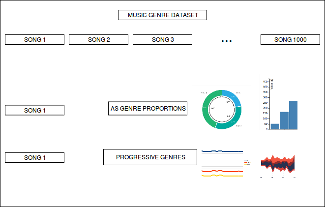

 

## Thinking of the Title

* Why Computational? The visualization is strictly based upon a statistical algorithm as opposed to a creative visualization.
* Why Essays? The underlying algorithms are theorized with design sensibilities as opposed to brute-force and indifferent computing.
<!-- * Interests: NLP, ML, unsupervised methods, digital humanities, computational social science -->

 

## All Visualizations across the domains,

* Have an associated Dataset,
* Have an underlying Algorithm,
* Serve a specific purpose

 

## Across the domains,
* Music
** Music Genre Dataset
** Probabilitic Topic Model
** Music Exploration
* Journalism
** Election Dataset
** Basic Statistical Model
** Election Result Analysis
* Business Analytics
** Company Sales Data
** Basic Statistical Model
** Yearly/Quarterly Analysis

 

## For every domain,
* Three possible visualizations
* Customized User tests across the three visualizations
* A single visualization chosen from the test analysis.

 

## The tools used for visualization,
There are several different tools that can be used for visualization. This thesis does not build a new tool, but chooses existing tools for build visualizations in the respective domains.

* Music ** D3 library ** Applicable beacuse the visualization is required for streaming services. Requires good coding skills.
* Business Analytics ** Tableau ** Applicable because it follows common standards. Requires rudimentary coding skills.
* Journalism ** ggplot ** Applicable because open source. Requires rudimentary coding skills.

 

## With Music,

 

* Visualization for Data Exploration: Embellishments of the genre-proportion displays
* Flow Visualization for Progressive Music Genres
  
